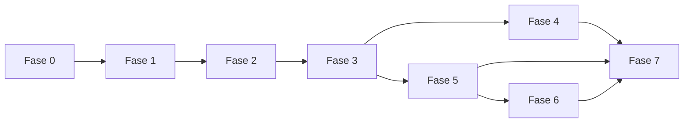

# CRM Silmer MVP — Plano de Implementação

> **Status:** Fase 0 em execução  
> **Design técnico:** `TECHNICAL-DESIGN.md`  
> **Topologia:** `EASYPANEL-TOPOLOGY.md`

Cada item deve resultar em commit atômico e manter rastreabilidade com os IDs
de aceite de `.specs/features/crm-mvp/spec.md`. Nenhuma fase avança sem seus
gates de verificação.

## Status operacional reconciliado

Em 02/09/2026, a T00.6 foi aprovada na issue `#10` e deixou de bloquear T02, T03 e T05.

A fonte humana está versionada em `docs/phase0/T00.6-APPROVAL-EVIDENCE.md`;
`docs/phase0/PHASE-0-APPROVAL-GATE.md` descreve o gate aprovado e
`docs/phase0/domain-decisions.json` é o espelho executável fail-closed. Os
papéis usam `silmer:romulo.sutil`, com MFA confirmado e exceção de operação
solo limitada ao piloto interno.

Essa aprovação remove apenas o bloqueio da T00.6; os demais gates técnicos,
externos e operacionais continuam independentes.

## Fase 0 — Fundação e riscos técnicos

### T00.1 Estruturar o monorepo JavaScript ESM

- **Status:** concluída em 30/08/2026.
- **Rastreabilidade:** fundação técnica que habilita os 32 requisitos do MVP;
  não satisfaz isoladamente um requisito funcional.
- Criar diretórios `apps/edge-web`, `apps/api`, `apps/worker` e `modules/*`.
- Fixar versões de Node, dependências e imagens.
- Configurar JSDoc/checkJs, lint, formatação e testes nativos.
- **Verificação:** build reprodutível, nenhum runtime framework no frontend e
  nenhum estado de domínio em `window`; usar ESM/IIFE/classes isoladas.

### T00.2 Criar CI e imagens imutáveis

- **Status:** concluída em 30/08/2026; SHA e digests aprovados foram publicados
  pelo run `33335770692` e configurados nos serviços `silmer-*`.
- **Rastreabilidade:** enabler de `MSG-02` e `MSG-03`; não satisfaz sozinho o
  comportamento funcional desses requisitos.
- Validar lint, testes, E2E/a11y, dependências, imagens e diff.
- Rejeitar commits de merge na faixa exclusiva de toda pull request; branches
  divergentes devem ser atualizadas por rebase sobre `master`.
- Publicar `edge-web` e `runtime` no GHCR por SHA/digest.
- **Verificação:** o digest aprovado é configurado no projeto operacional sem
  rebuild e permanece rastreável ao SHA de origem; o CI bloqueia histórico de
  PR não linear antes dos demais gates.

### T00.3 Provisionar serviços Silmer no EasyPanel

- **Status:** concluída por decisão operacional em 31/08/2026 no projeto
  compartilhado e duradouro `espectro-mvp`; riscos e follow-ups aceitos estão
  em `ops/easypanel/provisioning-gate.json`. Drills reais permanecem na issue
  `#3`.
- **Rastreabilidade:** suporte operacional a `MSG-03`, `MSG-04` e `PRV-01`;
  mocks não satisfazem esses requisitos funcionais.
- Manter `silmer-edge-web`, `silmer-api`, `silmer-worker` e `silmer-postgres`
  no projeto `espectro-mvp`, com prefixo que evita colisões.
- Aplicar redes, domínios, limites, health checks e segredos separados.
- Criar kit off-host de recovery com topologia, digests, DNS, migrations e
  inventário de segredos, sem valores sensíveis em arquivo versionado.
- **Verificação:** somente `silmer-edge-web` possui domínio/porta pública e uma
  segunda pessoa consegue reconstruir a topologia usando o kit e mocks.

### T00.4 Fechar spikes externos

- **Status:** matriz, fixtures e gates locais executáveis concluídos. A issue
  `#6` aprovou para o piloto interno mídia transitória em volume privado da VPS,
  até o fim da jornada ou sete dias, sem custo incremental; R2 foi diferido
  para a issue `#29`. Rose e Operação aprovaram o PDF sintético da issue `#7`,
  com versão, hash, seis critérios e evidência sem PII registrados. A issue `#8`
  aprovou o envelope do piloto e manteve o sizing KVM 4 em 31/08/2026, sem alegar
  execução da T07.1. Smokes e aprovações externos permanecem pendentes na
  issue `#5`.
- **Rastreabilidade:** `CHN-P04-01..14`, `MSG-01..04`, `ORD-03..05`,
  `PAY-02`, `PAY-05`, `PRV-P06-07` e `PRV-P06-11`.
- Validar WhatsApp Cloud API, assinatura, mídia, templates e status de entrega.
- Versionar matriz por efeito externo com suporte a idempotência, consulta do
  resultado, ponto de não retorno e estratégia para `outcome_unknown`.
- Validar provedor de IA, DPA/retenção e schema estruturado.
- Validar PDF da Ficha com Rose; validar a política de mídia transitória e o
  handoff operacional de arquivos válidos ao Dropbox sem presumir API.
- Levantar operadores, mensagens, bursts, anexos e massa esperada para aprovar
  ou ajustar o envelope de carga da seção 13 do TDD.
- **Verificação:** evidências e matriz versionadas, envelope aprovado e nenhum
  bloqueador de integração aberto.

### T00.5 Definir threat model e catálogo de dados

- **Status:** concluída em 01/09/2026; baseline local, validação executável e
  revisões de Tech Lead e Privacidade registradas na issue `#9` e em
  `docs/phase0/security-review.json`. Controles `planned` continuam nas tarefas
  funcionais correspondentes e produção Gemini com PII permanece bloqueada
  pela issue `#5`.
- **Rastreabilidade:** `PRV-01..03` e `PRV-P06-01..12`; controles marcados
  como `planned` permanecem nas tarefas funcionais correspondentes.
- Mapear ativos, atores, trust boundaries, PII, operadores e abusos.
- Ligar cada classe à retenção P0.6.
- **Verificação:** revisão de Tech Lead e Responsável de Privacidade.

### T00.6 Aprovar defaults de domínio e papéis

- **Status:** concluída em 02/09/2026. Produto, Operação e Privacidade
  aprovaram `D00.6-01..07`; `silmer:romulo.sutil` foi designado como Tech
  Lead, equipe e Administrador Técnico com MFA. A exceção
  `SOLO-OPS-PILOT-01` limita a concentração de funções ao piloto interno e
  preserva capacidades ortogonais, eventos separados e auditoria.
- **Rastreabilidade:** P0.7, `PAY-02`, `FIN-01..03`, `ORD-01/02/05`,
  `PRV-01..03`, `PRV-P06-12` e `ACL-P07-01..12`.
- Confirmar `Admin` para pagamento, Negócio 1:0..1 Pedido, ciclo de conversa,
  PDF canônico, moeda/timezone e exceção de pagamento.
- Confirmar o envelope de carga que qualifica sizing e SLOs.
- Designar Tech Lead, time e Administrador Técnico.
- **Verificação:** aprovação versionada em
  `docs/phase0/T00.6-APPROVAL-EVIDENCE.md`, gate executável aprovado e testes
  negativos dos controles compensatórios. T00.6 não bloqueia mais T02, T03 e
  T05; os gates próprios dessas fases permanecem aplicáveis.

### T00.7 Implantar telemetria e hardening mínimos

- **Status:** controles locais, testes negativos e política de alertas
  concluídos em 30/08/2026; monitor off-host, roteamento e simulações reais
  pendentes na issue `#11`, e digest publicado dependente da issue `#1`.
- **Rastreabilidade:** enabler de `PRV-01`, `PRV-02` e `PRV-P06-06`; não
  satisfaz sozinho a observabilidade completa da T06.5.
- Logs redigidos, request/correlation IDs, métricas de API/worker e alertas live.
- Usuário não-root, capabilities removidas, imagens por digest, filesystem
  read-only quando possível e temporários limitados.
- **Verificação:** falha simulada é detectada sem registrar PII.

## Fase 1 — Identidade, acesso e infraestrutura de domínio

### T01.1 Implementar migrations e acesso PostgreSQL

- **Status em 30/08/2026:** concluída localmente; runner, readiness, imagem e
  migrations `0001/0002` validados em PostgreSQL 17.6 efêmero.
- Criar runner expand/contract, transações e health/readiness.
- **Verificação:** migrate de zero, upgrade, execução concorrente e rollback de app.

### T01.2 Implementar sessão e usuários por convite

- **Status em 01/09/2026:** concluída na issue `#12`; adapters PostgreSQL,
  controllers `/api/v1`, lockout progressivo pseudonimizado, OpenAPI, runbook e
  fluxo acessível foram validados localmente e contra PostgreSQL 17 efêmero.
- Senha Argon2id, convite de uso único/expirável, cookie com token hasheado,
  rotação, expiração, CSRF, revogação, TOTP criptografado e recovery codes.
- **Verificação:** bootstrap auditado do primeiro Admin, login/logout/revogação,
  recuperação MFA e nenhum token no storage do browser.

### T01.3 Implementar funções e capacidades ortogonais

- **Status em 01/09/2026:** wiring IAM/ACL da issue `#12` concluído com
  transação única para grant/revoke, auditoria e revogação imediata de sessão.
  `ACL-P07-07..11` no ciclo real de Pedido/Ficha permanece na issue `#13`.
- Separar `Atendimento|Vendedor`, `COMMERCIAL_ADMIN`, `PRIVACY_OFFICER` e
  `TECHNICAL_PRIVACY_EXECUTOR`.
- Impedir autoatribuição; registrar concessão/revogação.
- Revogar sessões privilegiadas imediatamente após retirada de capacidade.
- **Verificação:** ACL-P07-01 a ACL-P07-12 e PRV-01 em testes negativos de API/UI.

### T01.4 Criar audit trail e idempotency records

- **Status em 01/09/2026:** concluída na issue `#12`; efeito, auditoria,
  resposta criptografada e estado idempotente compartilham o mesmo cliente e
  rollback PostgreSQL, com replay concorrente e conflito divergente provados.
- Persistir ator, ação, alvo, versão, motivo e correlação sem copiar conteúdo.
- **Verificação:** comandos repetidos retornam o mesmo efeito observável.

### T01.5 Criar configuração versionada

- **Status em 01/09/2026:** concluída na issue `#15`; adapter PostgreSQL,
  lock transacional para `expectedVersion`, auditoria atômica e wiring da API
  entregues. O runtime de canais recebe somente `channels`, `featureFlags` e
  número da versão, sem PIX, destinatário, template ou referência de segredo.
- FAB, PIX mascarado, destinatária, templates, canais e feature flags.
- **Verificação:** alteração privilegiada auditada e segredo não exposto.

### T01.6 Implementar catálogo versionado

- **Status em 01/09/2026:** concluída na issue `#15`; adapter PostgreSQL publica
  `draft`, itens e auditoria na mesma transação, valida `expectedLatestNumber`
  sob lock e lê apenas versões publicadas. Concorrência, rollback e imutabilidade
  histórica possuem teste PostgreSQL real.
- Importar/publicar tipos, modelos, malhas e técnicas autorizadas.
- Vincular seleção à versão e copiar snapshot para o Pedido.
- **Verificação:** atualização de catálogo não altera Negócio/Pedido histórico.

## Fase 2 — Caixa de Entrada, canais e confiabilidade

### T02.1 Implementar adapter canônico de canais

- Definir contratos inbound/outbound independentes da Meta e escopar IDs por
  `(provider, provider_account_id, external_id)`.
- **Verificação:** fixtures WhatsApp/Instagram convergem para o mesmo envelope
  e cobrem CHN-P04-01 a CHN-P04-04.

### T02.2 Implementar webhook WhatsApp

- Validar assinatura, deduplicar, persistir e responder rapidamente.
- Preservar raw body para a assinatura e rejeitar tamanho, tipo e schema
  inválidos antes de qualquer efeito.
- Para mídia, persistir metadados e `expires_at` idempotentes antes do download;
  manter bytes em quarentena privada, sem tornar arquivo duplicado disponível.
- **Verificação:** MSG-01, assinatura inválida, fuzz de payload e carga
  concorrente sem mensagens duplicadas.

### T02.3 Implementar fila PostgreSQL e worker

- Inbox/outbox, `available_at`, prioridade, lease/`locked_until`, claim com
  lock, reclaim, retry, jitter, heartbeat, máximo de tentativas, dead letter e
  estados `sent|failed|outcome_unknown`.
- Implementar o volume privado de mídia, quota fail-closed, escrita parcial
  segura, hash, validação, estado `lost/unavailable`, deleção no vencimento e
  recibo manual do handoff Dropbox. Evento terminal agenda deleção imediata;
  pendência de arquivo não estende o TTL.
- **Verificação:** kill antes, durante e depois do efeito respeita a matriz do
  provider; estado incerto não sofre retry cego, fica reconciliável, e poison
  message termina em reconciliação.

### T02.4 Implementar Conversa, Mensagem e Contato

- Estados de backlog, ciclos, `@usuario`/telefone pendente, identidades e
  merge/unmerge humano verificável.
- **Verificação:** INB-01, CHN-P04-05 a CHN-P04-08 e isolamento entre titulares.

### T02.5 Implementar reconciliação e saúde do canal

- Mostrar pendência, erro, `outcome_unknown`, tentativa, identificador externo,
  último evento e retomada condicionada à capacidade do provider.
- **Verificação:** MSG-02 a MSG-04 e retry auditável.

### T02.6 Implementar UI da Caixa de Entrada

- Lista, detalhe, filtros, estados, takeover e SSE.
- **Verificação:** teclado, foco, ARIA dinâmica, estados de erro/vazio/loading,
  autorização por tópico, reconnect com `Last-Event-ID` e cliente lento.

### T02.7 Implementar Instagram Direct feature-gated

- Webhook, outbound, saúde, reconciliação e `handoff_id` Instagram→WhatsApp.
- Manter feature flag desligável sem afetar o WhatsApp.
- **Verificação:** CHN-P04-01 a CHN-P04-12; indisponibilidade não bloqueia go-live.

## Fase 3 — Negócio, Kanban e qualificação

### T03.1 Implementar conversão idempotente em Negócio

- Vincular/criar Contato, criar Deal em Produto e encerrar ciclo do backlog.
- **Verificação:** INB-02 a INB-04 sob clique e transação concorrentes.

### T03.2 Implementar máquina de estados do Deal

- Etapas, gates, histórico, retorno e perda com motivo.
- **Verificação:** JRN-01 a JRN-04 e JRN-09.

### T03.3 Implementar campos e itens da Ficha

- Itens, malhas, partes, grade, estampa, logística e `field_assessments`.
- **Verificação:** inventário P0.1 coberto e JRN-05.

### T03.4 Implementar Kanban acessível

- Card como projeção do Deal, atualização otimista e alternativa ao drag-and-drop.
- **Verificação:** fluxo completo por teclado e nenhum estado independente no Card.

### T03.5 Implementar tarefas, responsável e handoff humano

- SLA operacional, atribuição, transferência e retomada.
- **Verificação:** nenhum handoff fica sem responsável.

### T03.6 Implementar detalhe acessível do Negócio

- Exibir qualificação, itens, gates, histórico, tarefas, conflitos e ações de
  avanço/retorno/perda sem depender do Kanban.
- **Verificação:** loading/vazio/erro/409, foco após mutação, mensagens de erro
  associadas e jornada completa por teclado em Playwright + axe-core.

## Fase 4 — Vendedor Silmer assistivo

### T04.1 Implementar compositor de contexto

- Janela recente, resumo, campos oficiais, sugestões, catálogo e orçamento vigente.
- **Verificação:** limites de tokens, proveniência e exclusão de dado não autorizado.

### T04.2 Implementar adapter AIProvider

- Schema estruturado, timeout, retry, custo, modelo e redaction.
- **Verificação:** troca por fake provider sem alterar módulos de CRM.

### T04.3 Implementar sugestões separadas

- Resposta, field suggestion, stage suggestion e handoff sem comando de mutação.
- **Verificação:** AGT-01 a AGT-08 e CHN-P04-09/10; nenhum campo oficial alterado pela IA.

### T04.4 Implementar takeover seguro

- `automation_epoch`, cancelamento/revalidação, ponto de não retorno por adapter
  e reativação humana.
- **Verificação:** takeover impede novas tentativas antes do ponto de não
  retorno; chamada já aceita termina em `sent|outcome_unknown` visível e
  reconciliável; CHN-P04-11/12 e kill switch bloqueiam novos envios imediatamente.

### T04.5 Criar evals de segurança comercial

- Preço, prazo, desconto, prompt injection, dado conflitante e pedido de humano.
- **Verificação:** zero violação nos casos bloqueantes antes de homologação.

## Fase 5 — Orçamento, PIX, Pedido e Ficha

### T05.1 Implementar orçamento versionado

- Versão, validade, aprovação Admin, invalidação e comunicação fiel.
- **Verificação:** PRC-01 a PRC-07 e orçamento stale nunca comunicado.

### T05.2 Implementar ledger de vendido

- Reconhecer exatamente uma vez em `aprovado_aguardando_pix`; perda/cancelamento
  invalida quote, encerra cobrança quando possível e gera reversão lógica.
- **Verificação:** FIN-01 a FIN-03 e FIN-P03-01 a FIN-P03-07 sem dupla contagem.

### T05.3 Implementar subfluxo PIX

- Cobrança única, chave configurada, comprovante, rejeição, exceção autorizada,
  retorno ao PIX, cancelamento e confirmação Admin.
- **Verificação:** PAY-01 a PAY-04 e JRN-06/JRN-07 em todos os ramos.

### T05.4 Implementar número e Pedido

- Contador transacional `01-CRM`, FAB e snapshot dos itens.
- **Verificação:** ORD-P05-01 a ORD-P05-09 sob concorrência, incluindo autoria,
  origem e chave idempotente da reserva.

### T05.5 Implementar ciclo da Ficha

- Rascunho, revisão, aprovação, substituição, cancelamento e ACL.
- **Verificação:** ORD-01/02/05 e ACL-P07-06 a ACL-P07-12.

### T05.6 Implementar PDF íntegro e reproduzível

- Template e snapshot canônico versionados; fixar Chromium, fontes, locale e
  timezone; registrar SHA-256 do artefato e campos de produção vazios.
- **Verificação:** golden visual, revisão de Rose e hash determinístico do snapshot.

### T05.7 Implementar envio e onboarding

- Envio inicial, retry, reenvio, cancelamento, aviso de cancelamento para Rose e
  mensagem de boas-vindas, todos reconciliáveis.
- **Verificação:** ORD-03/04, PAY-05, JRN-08 e ACL-P07-09 a ACL-P07-11 sem duplicidade.

### T05.8 Implementar segurança de anexos

- Quarentena, limites, MIME real, hash, ClamAV, download Meta com proteção SSRF,
  timeout/redirect e URLs assinadas `no-store`.
- **Verificação:** malware, payload grande, MIME falso e URL interna são
  bloqueados; assinatura ClamAV acima de 36 horas mantém anexo em quarentena.

### T05.9 Implementar UI comercial, PIX, Pedido e Ficha

- Orçamento versionado, aprovação, PIX/comprovante, exceção, Pedido, revisão da
  Ficha, envio, falha e reconciliação com ações autorizadas.
- **Verificação:** todos os estados e conflitos são operáveis por teclado, foco
  retorna ao contexto após comandos, status assíncrono é anunciado e testes
  Playwright + axe-core cobrem caminho feliz e falhas recuperáveis.

## Fase 6 — Privacidade, relatórios e operação

### T06.1 Implementar retenção por classe

- Jobs por vencimento e evento terminal, com sweeper diário de segurança,
  exclusão/anonimização e reconciliação por destino. A mídia transitória usa o
  menor prazo entre sete dias e encerramento; documentos duráveis ficam fora
  desse sweep.
- **Verificação:** PRV-02/03 e PRV-P06-01 a PRV-P06-08 com relógio controlado.

### T06.2 Implementar legal hold e solicitações

- Protocolo, verificação, decisão, execução, propagação e evidência, incluindo
  recibo operacional `success|failure|limitation` para o Dropbox enquanto não
  houver adapter aprovado.
- **Verificação:** PRV-01 a PRV-03 e PRV-P06-09 a PRV-P06-12.

### T06.3 Implementar tombstones de restore

- Ledger externo pseudonimizado, bucket e credenciais dedicados, proteção contra
  overwrite/delete e reaplicação antes do ready.
- **Verificação:** runtime de dados não acessa tombstones; writer não altera nem
  exclui entrada; restore read-only reaplica o ledger e backup antigo não
  reintroduz titular excluído.

### T06.4 Implementar relatórios comerciais

- Total vendido, quantidade, ticket médio, canceladas e perdidas.
- **Verificação:** período/timezone corretos e leitura apenas de projeções.

### T06.5 Implementar observabilidade e alertas

- Métricas, logs redigidos, traces, custo IA, jobs, canal e backup.
- **Verificação:** cada alerta mínimo é disparado em teste controlado.

### T06.6 Implementar UI de relatórios, configuração e privacidade

- Relatórios comerciais, saúde operacional, configuração permitida, solicitações
  de titular, legal hold e evidências conforme capacidade do ator.
- **Verificação:** autorização negativa API/UI, tabelas e filtros acessíveis,
  estados loading/vazio/erro, confirmação destrutiva e operação completa por
  teclado em Playwright + axe-core.

## Fase 7 — Hardening, UAT e piloto

### T07.1 Executar testes de carga e concorrência

- Webhook, SSE, jobs, contador, PDF e consultas do Kanban usando o envelope
  aprovado da seção 13 do TDD.
- **Verificação:** relatório registra dataset, duração, taxas, concorrência,
  percentis e erros; SLOs só são considerados atendidos dentro desse envelope.

### T07.2 Executar auditoria de segurança e acessibilidade

- OWASP, secrets, SBOM/scan de imagem, headers, uploads, teclado, foco, ARIA e
  contraste.
- **Verificação:** zero finding crítico/alto aberto e matriz de superfícies
  comprova Caixa de Entrada, Kanban, detalhe, comercial/Ficha e
  relatórios/configuração/privacidade sem mouse.

### T07.3 Executar recovery drill

- Executar restore mensal do banco isolado e drill de perda total em VPS limpa,
  usando kit off-host, escrow de segredos, tombstones, digests, recuperação de
  versão de objeto, troca de DNS de drill e adapters mock.
- **Verificação:** RPO até 1 h e RTO até 4 h do CRM completo demonstrados no host
  limpo, sem reutilizar EasyPanel de produção nem copiar produção para HML.

### T07.4 Executar UAT operacional

- Conversa real de teste até PIX, Ficha, Rose e onboarding.
- **Verificação:** aceite de Operação, Produto e Privacidade.

### T07.5 Fazer go-live controlado

- Checklist, janela, responsáveis, monitoramento e rollback prontos.
- **Verificação:** WhatsApp oficial saudável e nenhuma pendência P0/P1 bloqueante.

## Dependências e caminho crítico

Fase 4 depende de contexto de Fases 2/3. Fase 5 pode começar depois do núcleo do
Deal, em paralelo ao hardening da IA. Privacidade acompanha todas as migrations
e não deve ser deixada apenas para Fase 6.

## Definition of Done global

- Critério rastreável atendido e teste automatizado correspondente.
- Autorização testada na API e na UI.
- Migração compatível com rollback.
- Logs sem PII/conteúdo proibido.
- Observabilidade e runbook atualizados.
- Acessibilidade por teclado validada.
- Estados loading/vazio/erro/conflito e foco pós-mudança cobertos em cada superfície UI.
- Efeito externo incerto termina em `outcome_unknown` visível, nunca em retry cego.
- Teste de performance registra e respeita o envelope de carga aprovado.
- Estado de domínio não exposto em `window`.
- Commit atômico, push e `graphify update .` concluídos.
