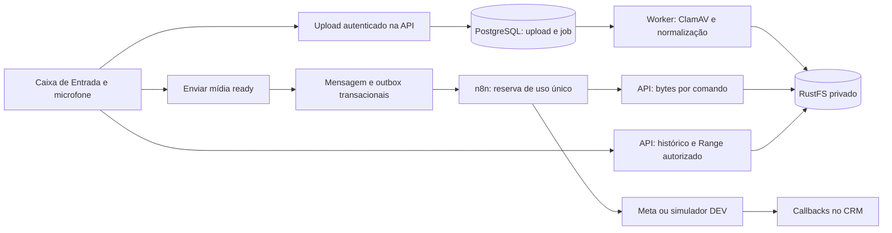

# Mídia no chat — Design

Spec: [spec.md](spec.md). Contexto: [context.md](context.md).
Status: Draft; storage, gravação e retenção decididos; contratos abaixo propostos.
Complexidade: Large, com API, persistência, UI, worker e integração externa.

## Architecture Overview

O CRM recebe uploads autenticados em streaming e usa área temporária privada
limitada. O worker existente verifica MIME/codec, executa ClamAV e normaliza
gravações. Só publica objeto validado no RustFS. PostgreSQL controla estado,
vínculo com conversa/ator, versão, idempotência e quota reservada.

O envio humano vincula uma mídia ready a uma mensagem e cria o comando n8n
na mesma transação. n8n reserva o efeito, busca os bytes pela API técnica
restrita ao comando e faz upload na Meta; envia a mensagem usando o media ID
retornado. A variante DEV baixa os mesmos bytes, mas simula Meta e callbacks.

### Alternativas avaliadas

Recomendação: proxy de upload/leitura pela API. Mantém a autorização por
conversa em cada requisição e evita URLs portadoras em logs/browser. RustFS
com URLs assinadas reduziria banda da API, mas exigiria CORS, expiração e
controle pós-upload; fica para outra decisão. Volume local não atende à
escolha do usuário. Nenhum framework/store/Redis/microserviço é introduzido.

## Code Reuse Analysis

| Componente         | Localização                                                               | Reuso ou extensão                                                                          |
| ------------------ | ------------------------------------------------------------------------- | ------------------------------------------------------------------------------------------ |
| Envio humano       | modules/inbox-channels/src/application/inbox-service.js:107               | Validar tipo e mídia antes do comando existente                                            |
| Transação de envio | modules/inbox-channels/src/adapters/postgres-inbox-repository.js:343      | Lock, ownership, takeover, mensagem, auditoria e outbox                                    |
| Outbox CRM→n8n     | modules/n8n-integration/src/postgres-command-outbox.js:72                 | Acrescentar referência de mídia; preservar texto                                           |
| Reserva humana     | modules/n8n-integration/src/postgres-repository.js:1182                   | Conferir referência e hash imutáveis no fence                                              |
| Workflow humano    | ops/n8n/workflows/k7tI6T4RhQPyJkn9-mvp-simple.sdk.js:1266                 | Atualmente aceita só text; adicionar rota por tipo                                         |
| DEV                | ops/n8n/workflows/create-dev-test-workflow.mjs:163                        | Manter entrada sintética; adaptar saída humana com bytes reais                             |
| Scanner            | modules/integration-reliability/src/clamav-media-scanner.js:18            | ClamAV + libmagic, assinatura até 36 horas                                                 |
| Validação local    | modules/integration-reliability/src/private-media-volume.js:155           | Reusar lógica de streaming/hash/limites, sem acoplar mídia persistida a volume transitório |
| Histórico          | modules/inbox-channels/src/adapters/postgres-inbox-read-repository.js:331 | Enriquecer DTO com mídia e status; hoje só preview                                         |
| Cliente HTTP       | apps/edge-web/src/lib/api-client.js:28                                    | Hoje JSON-only; incluir FormData sem Content-Type manual                                   |
| UI                 | apps/edge-web/src/views/InboxView.vue:501                                 | Composição Vue local; não criar estado em window                                           |
| Retenção legada    | modules/integration-reliability/src/postgres-transient-media.js:273       | Preservar contrato legado; nova tabela não participa do expurgo                            |

## Components

### Storage privado S3

Novo modules/integration-reliability/src/rustfs-media-store.js com
putValidated(stream, key, metadata), head(key), read(key, range) e
deleteDraft(key). Cliente @aws-sdk/client-s3 restrito às operações necessárias,
versão fixada e licença/audit verificados durante implementação. Não reutilizar
o smoke R2 como prova de RustFS. Backend faz GET assinado por credencial S3,
sem URL pública/assinada retornada ao browser.

Configuração proposta: MEDIA_S3_ENDPOINT, MEDIA_S3_REGION,
MEDIA_S3_BUCKET, MEDIA_S3_ACCESS_KEY_ID, MEDIA_S3_SECRET_ACCESS_KEY e
MEDIA_S3_FORCE_PATH_STYLE=true. Valores entram no mecanismo de secrets do
ambiente; region e assinatura precisam de smoke no alpha. Não embutir credencial
no .env versionado, workflow exportado, console do browser ou documentação.

API/worker usam papéis distintos limitados ao bucket CRM do ambiente. n8n usa
Basic do CRM para ler bytes por comando; não recebe chave S3. DEV não consegue
ler bucket operacional. Sem ACL pública e sem dependência de lifecycle S3.

### Pipeline de processamento

Upload fica temporariamente em spool privado montado na API/worker, UUID opaco,
sem nome do cliente. API reserva quota transacional antes de consumir bytes.
Migration expand 0029 registra admissões em `chat_media_admissions` com UUID
do spool, hash somente do crm_session canônico e reserva. A API não mantém
transação SQL aberta durante streaming. Conclusão converte ledger em mídia
e job na mesma transação e ajusta reserva aos bytes reais. Arquivo vazio usa
422 antes do 202, sem input_size_bytes fictício. Replay aceito mede/hash bytes
sem novo spool/cobrança, inclusive com quota cheia; receiving ativo usa 409.
Commit incerto exige consultar estado do ledger sob lock: consumed preserva
spool; falha da reconciliação também preserva. Somente receiving confirmado
permite cleanup/release. Crash mantém reserva. Discovery
`listAbandonedAdmissions` fornece receiving >24h para lock/recheck e limpeza
confirmada em T22; o método não executa cleanup nesta fase.
Admissão T7 reserva o pior caso antes do streaming: anexo, duas vezes o
limite do tipo; gravação, três vezes 16 MiB. Após medir os bytes reais,
pode ajustar para duas vezes a entrada do anexo, ou entrada mais duas vezes
16 MiB na gravação. Content-Length não autoriza escrita além da reserva.
Essa conta cobre spool, intermediário/variante e objeto conjuntamente.
Limite é aplicado durante streaming e confirmado pelo tamanho/hash real.

Worker usa jobs PostgreSQL; inicia com duas conversões simultâneas no máximo.
ClamAV falha fechado, libmagic verifica MIME, ffprobe verifica container,
codec e duração. FFmpeg/ffprobe entram na imagem runtime existente como
dependência justificada, sem serviço novo. Use execFile com argumentos fixos,
protocolos locais, sem shell e sem abrir recursos externos apontados pelo arquivo.
Timeout do encoder: 120 segundos; cada scan 60 s, probe 10 s e decodificação de
timeline 30 s; libmagic 10 s por arquivo. Gravação completa tem orçamento máximo de 340 s das fases locais,
além de IO/DB; handler renova lease durante todas as fases. Conversões são
sequenciais com threads=1 e memória, CPU e spool limitados. Escolha em T5 evita
declarar timeout de 120 s total que não mataria os subprocessos de outras fases.

Gravações são normalizadas para OGG/Opus mono; anexos válidos não são
transcodificados por padrão. Scan e validação alcançam a entrada e o arquivo
final; limite de 16 MiB se aplica aos dois. Saída limpa vai ao RustFS; ready só
é gravado após PUT, confirmação de integridade e remoção confirmada do spool.
SHA, tamanho e MIME da variante são persistidos antes do PUT; HEAD divergente
impede sobrescrita e publicação. Somente depois do cleanup, ready reduz a
reserva ao objeto final; used muda apenas no vínculo T10. Falha de cleanup
ou rollback mantém a reserva anterior. Crash PUT/DB reconcilia chave
determinística de upload/variante; não cria segundo arquivo visível.

Falha conhecida antes do envio admite retry de processamento com o mesmo
upload_id. Timeout após efeito Meta segue reconciliação, sem novo envio.

### UI

MediaComposer.vue: uma mídia selecionada, prévia, estado de validação, remover,
legenda imagem/vídeo e envio explícito. AudioRecorder.vue: iniciar, duração,
parar, ouvir, descartar e enviar; captura nunca começa no mount. Negotiar MIME
via MediaRecorder.isTypeSupported. MediaMessage.vue: imagem, audio/video com
controles nativos, preload=metadata, sem autoplay, estado unavailable/lost.

Navegação por Tab/Enter/Espaço; Escape cancela prévia quando não há envio em
curso. Ao concluir/descartar, retornar foco ao acionador/composer. Região de
status anuncia mudanças sem narrar cada segundo. Parar tracks e revogar URLs
ao trocar conversa, sair da tela, cancelar ou encerrar captura. Texto continua
disponível em falha de upload ou ausência de microfone.

## Data Models

Não transformar crm.transient_media em arquivo persistente nem remover seu
expires_at globalmente: a tabela possui trigger de imutabilidade e jobs de
fim de jornada. Criar uma classe nova, isolada do sweeper legado.

### crm.chat_media

- id UUID; conversation_id FK; uploaded_by FK de usuário; upload_command_id
  único por ator/conversa; request_fingerprint para replay.
- message_id FK nullable e UNIQUE: um arquivo por mensagem, vínculo de uso único.
- kind image/audio/video; origin attachment/recording; filename_envelope cifrado.
- state uploaded/processing/ready/attached/rejected/unavailable/lost;
  validation_status; sanitized_reason; original_sha256 e content_sha256.
- object_key UUID opaco; storage_backend=rustfs; storage_bucket_alias;
  size_bytes, detected_mime_type, container, codecs e duration_ms.
- created_at, processed_at, attached_at; retention_class=chat_retained;
  sem expires_at para mídia enviada. Tempo limite de rascunho é derivado
  de created_at enquanto message_id é NULL, não aplicado a attached.
- reservation_bytes e versão/CAS para quota, processamento e cleanup concorrentes.

Mensagem mantém content_envelope cifrado com {mediaId, caption}; bytes não
ficam no PostgreSQL. A relação nova não usa crm.attachments, cujo FK aponta
para transient_media. Índice em conversation_id/message_id e varredura
parcial de rascunhos; nenhuma query de histórico faz GET S3 por linha.

Job chat_media.process identifica chat_media.id; ajustar constraints da
tabela de jobs por migration expand nova, sem editar migrations publicadas.
Uma função transacional liga mídia ready à mensagem e revalida dono,
conversa/versão/terminal, hash e quota. Envio humano conserva takeover existente;
upload e gravação sozinhos não assumem atendimento nem iniciam automação.

## API e contratos propostos

Prefixo /api/v1. Todos os endpoints humanos usam sessão/capacidade de
conversa; mutações usam CSRF, Idempotency-Key e controle de versão vigente.

| Endpoint                                         | Resultado                                                                        | Limites / permissão                                                                                                    |
| ------------------------------------------------ | -------------------------------------------------------------------------------- | ---------------------------------------------------------------------------------------------------------------------- |
| POST /conversations/{id}/media                   | 202 com mediaId, state=processing e statusUrl; replay devolve resultado original | Multipart: um arquivo, origin, versão; permissão de envio sem takeover no upload                                       |
| GET /conversations/{id}/media/{mediaId}          | 200 DTO de status/metadados                                                      | Enquanto rascunho: ator do upload ou admin; depois: autorização de leitura da conversa                                 |
| GET /conversations/{id}/media/{mediaId}/content  | 200 ou 206 streaming                                                             | Ready de rascunho restrito ao ator/admin; attached por ACL da conversa; Cache-Control private,no-store; nosniff        |
| POST /conversations/{id}/messages, existente     | 202, messageType=image/audio/video e content={mediaId,caption?}                  | Mídia ready ligada ao mesmo ator/conversa; proibir URL/key arbitrária                                                  |
| GET /integrations/n8n/commands/{commandId}/media | 200 streaming                                                                    | Basic AUTOMATION_EXECUTOR e capacidade específica; comando reservado processing, message_id/mediaId/hash/epoch válidos |

Novo GET técnico é extensão explícita ao contrato anterior de três endpoints;
não esconder a alteração sob a ADR 003. n8n pede bytes apenas depois da reserva.
Replay da reserva continua send_authorized=false; GET de bytes não concede
segunda autorização de envio. Verificar fence novamente antes do efeito Meta.
Novo payload inclui media_id, sha256, mime_type, size_bytes e type; o hash de
autorização cobre referência, variante e legenda, não hostname arbitrário.

MED-04: 413 para excesso de bytes; 422 somente para campos/legenda ou tipo
declarado inválidos detectados antes de aceitar o POST. MIME real, codec e
duração reprovados pelo worker não alteram o 202 já devolvido: o GET de status
retorna 200 com state=rejected e reason=invalid_format (MED-29). 401/403 para acesso,
409 para estado/replay divergente, 429 para quota/throttle, 503 para dependência,
410 para objeto perdido conhecido; formatos application/problem+json existentes.
Range único aberto/sufixo aceito; intervalos múltiplos ou inválidos retornam 416.
Evitar armazenar o arquivo inteiro na memória para servir áudio/vídeo.

Propostas iniciais: quota DEV 1 GiB e operacional 10 GiB, com reserva SQL;
ajustar pelo espaço real observado antes de ativar. Limite de 12 uploads/minuto
por sessão e um upload em progresso por composer. Alertas técnicos em 80%/90%;
atingir quota bloqueia mídia nova sem apagar anexos preservados nem bloquear texto.

Quota contabiliza bytes preservados mais reservas pendentes, nunca apenas
uploads em progresso. Ao passar ready → attached, converter a reserva em
ocupação persistida sem liberar espaço fictício. Originais/intermediários e
saída normalizada consomem a quota de spool enquanto existem; a ocupação
persistida soma todos os objetos finais mantidos. Só liberar ocupação após
remoção confirmada do rascunho ou exclusão explicitamente autorizada por
política futura. Testar uploads sucessivos já attached até 429 e corrida entre
processamento, envio e cleanup, sem dupla cobrança nem quota negativa.

## n8n e validação sem WhatsApp

Produção: CRM outbox → webhook de painel → reservar → buscar bytes restritos
→ POST Meta /media → POST Meta /messages com media ID → callback. Perda de
resposta de /messages gera unknown. Upload em /media não equivale a mensagem
enviada. Não passar URL autenticada do CRM à Meta nem abrir bucket para ela.

DEV mantém os nós de reserva/callback, lê bytes reais e compara hash/tamanho;
simula apenas efeito Meta. Cobrir success, failed-before-send, send_unknown,
duplicidade, mídia de outra conversa, epoch alterado e media_missing.
Estado simulado deve aparecer como simulado na UI/evidência; não como
comprovação de entrega WhatsApp. A janela do Chat Trigger segue como cliente
sintético e não recebe push humano assíncrono por presunção.

Entrada de mídia do cliente via chat n8n/IA não é exigida nesta fatia. O teste
inicia conversa por texto no Chat Trigger, faz handoff e envia pelo CRM.

## Retenção, transição e recovery

Anexos enviados ficam em chat_retained, sem lifecycle de expiração de objetos
no bucket e sem job de limpeza ao encerrar. Não configurar o bucket para
backup automático no bucket hermes-backups; cópia externa tem destino próprio.

Rascunhos sem message_id por 24 horas podem ser removidos após lock/recheck;
ready ligado por transação concorrente nunca é apagado. Rejeitados/partiais
e intermediários de conversão são removidos ao terminar o processamento.
Falha de remoção é pendência técnica com retry limitado à limpeza, nunca envio.

Transição de legado é controlada: inventariar somente cópias disponíveis;
copiar, validar hash e registrar nova referência persistente antes de cancelar
jobs de expurgo correspondentes. A operação exige lock para impedir corrida
com DELETE iniciado; objeto já indisponível fica lost e não promete restauração.
Não apagar o volume ou impor nova retenção a backups/Pedidos nesta tarefa.

Backup externo independente de VPS/RustFS inclui objetos vinculados e manifesto
de hashes para reconciliação com PostgreSQL; exercício de restore isolado
comprova vínculo/hash/playback. Herda RPO/RTO do projeto e sua evidência,
sem considerar quatro volumes no mesmo host como cópia independente.
Sem comprovação, registrar gate pendente e limitar uso a testes sintéticos.

## Error Handling Strategy

| Falha                         | Tratamento                                                    | Experiência                                                 |
| ----------------------------- | ------------------------------------------------------------- | ----------------------------------------------------------- |
| Upload interrompido           | Rascunho recuperável pelo mesmo upload_id; cleanup de parcial | Prévia preservada, retry explícito                          |
| Scanner/encoder indisponível  | state=unavailable, nenhum envio permitido                     | Motivo seguro e possibilidade de anexar formato suportado   |
| RustFS timeout PUT            | Reconciliar key/head/hash; não publicar ready incerto         | Processando/pendente, sem mensagem duplicada                |
| PUT concluído e commit falhou | Job reconcilia mesmo ID ou limpa somente órfão                | Nenhum falso sucesso                                        |
| n8n/Meta timeout após efeito  | unknown, reconciliação existente                              | Pendência visível sem retry cego                            |
| Permissão/versão mudou        | Revalidar antes do vínculo e reserva; 403/409                 | Bloquear envio; preservar rascunho para decisão do operador |
| Objeto perdido                | lost; preservar metadados                                     | Arquivo indisponível no histórico                           |

## Risks & Concerns

| Concern                                               | Location (file:line)                                                      | Impact                                         | Mitigation                                                                          |
| ----------------------------------------------------- | ------------------------------------------------------------------------- | ---------------------------------------------- | ----------------------------------------------------------------------------------- |
| RustFS configurado alpha.99                           | context.md:24                                                             | Documentação atual pode divergir               | T1 smoke na versão instalada; digest e negativas por bucket; upgrade não automático |
| Sem backup de volume mostrado                         | context.md:29                                                             | Preservação não garante recuperação            | T23 backup externo/restore com gate explícito                                       |
| Outbox descarta referência                            | modules/n8n-integration/src/postgres-command-outbox.js:79                 | Média chega como null                          | T12 acrescenta referência estável e testes de fingerprint                           |
| Workflow aceita só text                               | ops/n8n/workflows/k7tI6T4RhQPyJkn9-mvp-simple.sdk.js:1274                 | Mídia rejeitada mesmo com UI pronta            | T14/T15 rotas e simulador com bytes reais                                           |
| Histórico retorna só preview                          | modules/inbox-channels/src/adapters/postgres-inbox-read-repository.js:346 | Anexo não reproduz                             | T16 DTO sem N+1 S3 e T20 controles nativos                                          |
| Helpers HTTP serializam JSON                          | apps/edge-web/src/lib/api-client.js:42                                    | FormData quebrado                              | T17 preserva multipart e testes de CSRF                                             |
| Sweeper de encerramento                               | modules/integration-reliability/src/postgres-transient-media.js:273       | Apaga arquivo que deve permanecer              | T2 tabela isolada e T22 negativas contra jobs antigos                               |
| MediaRecorder varia por browser                       | Fonte MDN abaixo                                                          | WebM não deve ir direto ao canal por suposição | T5 normaliza; T19 negocia MIME; T24 UAT browser                                     |
| Acesso S3/compatibilidade não testados nesta inspeção | context.md:25                                                             | Falsear prontidão operacional                  | T1 é pré-condição para ativação, não check concluído                                |

## Tech Decisions

Auditoria da baseline em 05/10/2026 encontrou vulnerabilidade alta em
source-map-js (GHSA-68fv-2mgg-jv7q). Não foi introduzida pelo plano, que não
altera dependências. Corrigir em manutenção própria antes de satisfazer o
gate de dependências de Execute/release; não ignorar nem reduzir o audit-level.
O E2E da baseline também retornou 6 falhas (101 passaram, 7 skips), sem
alteração de aplicação/testes nesta entrega. A investigação e o fechamento
desses gates precedem o aceite da implementação; detalhes em planning-review.md.

| Decision             | Choice                          | Rationale                                                     |
| -------------------- | ------------------------------- | ------------------------------------------------------------- |
| Registro persistente | Tabela nova chat_media          | Isola bytes preservados dos contratos transitórios existentes |
| Transporte           | Proxy autenticado em streaming  | Controle de ACL em cada leitura; sem signed URL no browser    |
| Processamento        | Worker PostgreSQL existente     | Trabalho limitado; nenhuma infraestrutura adicional           |
| Formato de gravação  | OGG/Opus mono após normalização | Browser não determina sozinho formato entregue ao canal       |
| Status do plano      | Draft                           | Não alegar aprovação dos detalhes ainda não revisados         |

## Fontes e limites da pesquisa

- [RustFS: matriz S3](https://docs.rustfs.com/en/reference/s3-compatibility):
  documenta subconjunto testado; não prova suporte no alpha instalado.
- [MDN: MIME de gravação](https://developer.mozilla.org/en-US/docs/Web/API/MediaRecorder/isTypeSupported_static):
  consultar suporte antes de gravar; gravação ainda pode falhar por recursos.
- [MDN: microfone](https://developer.mozilla.org/en-US/docs/Web/API/MediaDevices/getUserMedia):
  requer contexto seguro e permissão; usar somente audio=true.
- Context7 não está disponível entre as ferramentas descobertas nesta sessão.
- Documentação Meta não pôde ser aberta na pesquisa. Revalidar allowlist,
  codecs, limites em bytes, voice flag e API version na fonte oficial antes
  do envio real. O DEV não satisfaz esse gate.

## Rollout e rollback

1. Smoke isolado RustFS, acesso mínimo e backup/restore; não alterar Hermes.
2. Migration expand compatível, API/worker com feature desativada.
3. Validar upload/scan/codec/retenção/concorrência e DEV sintético.
4. Publicar contrato n8n e UI após API compatível; ativar mídia no DEV.
5. Homologar WhatsApp separado e ativar operacional com evidência.
6. Rollback desativa novos uploads/envios de mídia; texto continua. Preservar
   chat_media, bytes e comandos unknown. Não reativar DELETE transitório para
   essa classe, não reverter por DROP e não restaurar banco como primeiro recurso.
