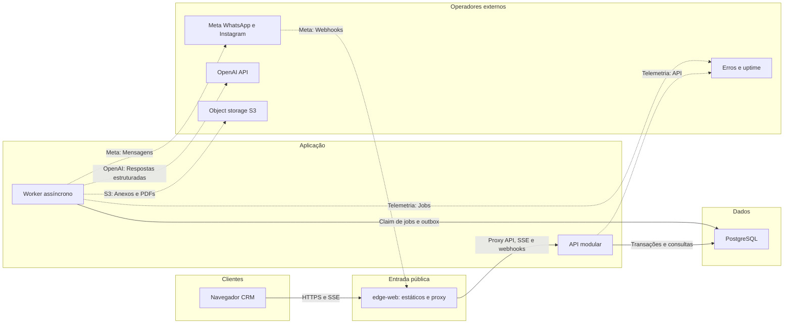
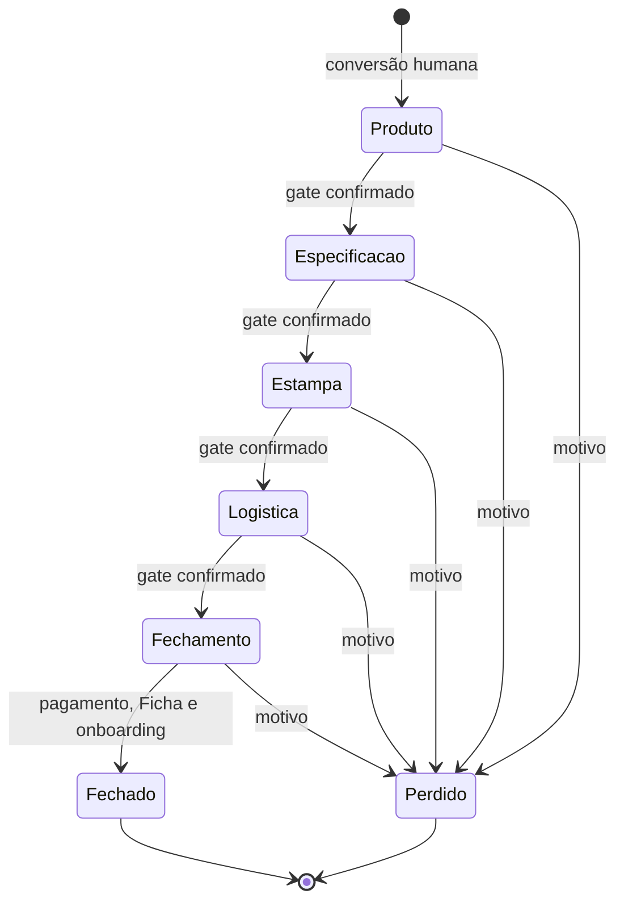
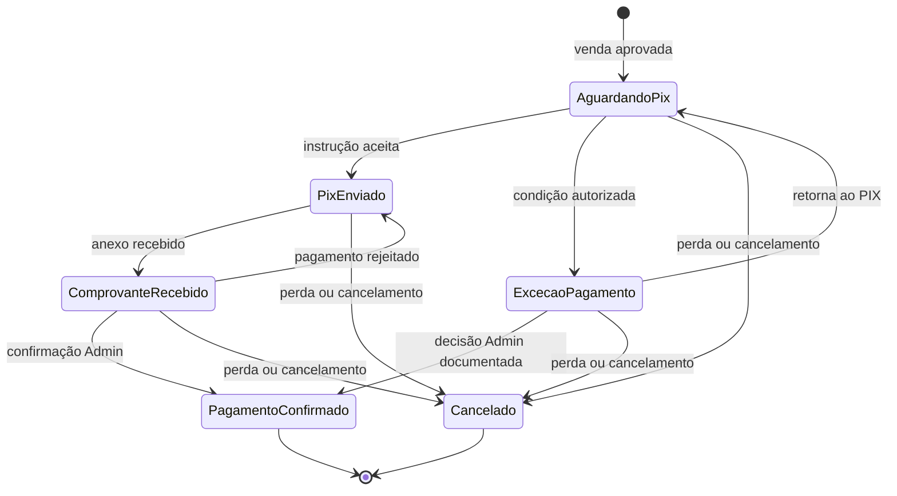

# TDD — CRM Silmer MVP

| Campo | Valor |
|---|---|
| Status | Baseline proposta para aprovação técnica e operacional |
| Criado em | 30/08/2026 |
| Última atualização | 30/08/2026 |
| Produto | CRM Silmer |
| Tech Lead | A designar formalmente pela Silmer |
| Responsável de Privacidade | Rômulo Sutil Corrêa |
| Time de implementação | A definir |
| Epic | `crm-mvp` |
| PRD canônico | `CRM-MVP-ESPECIFICACAO.md` |
| Requisitos rastreáveis | `.specs/features/crm-mvp/spec.md` |
| Topologia operacional | `EASYPANEL-TOPOLOGY.md` |

## 1. Resumo executivo

O CRM Silmer será implementado como um **monólito modular em JavaScript ESM**,
implantado em três processos independentes a partir do mesmo repositório:

1. `edge-web`: Nginx não-root, arquivos HTML/CSS/JS vanilla e reverse proxy.
2. `api`: REST, autenticação, comandos, consultas e SSE.
3. `worker`: webhooks, IA, documentos, envios, retries, retenção e reconciliação.

O PostgreSQL é a fonte de verdade e também sustenta a fila durável por meio de
inbox/outbox e jobs transacionais. Anexos e Fichas ficam em object storage
externo privado. Redis, MinIO, n8n, microserviços, vector database e GraphQL
não entram no MVP.

Esta solução privilegia consistência, recuperação e simplicidade operacional.
Ela mantém os formatos da Meta, do provedor de IA e do storage fora do núcleo
do CRM e preserva uma rota de evolução sem distribuir prematuramente o sistema.

## 2. Contexto e motivação

O projeto é greenfield: o repositório contém contratos de produto, regras,
design e a planilha que define a Ficha de Pedido, mas ainda não contém código
de runtime. O CRM substituirá integralmente o Datacrazy; o material em
`historico-datacrazy/` é apenas histórico e não orienta a arquitetura.

O produto precisa distinguir conversas recebidas de oportunidades comerciais,
conduzir uma jornada com gates verificáveis, operar um agente de IA assistivo,
registrar venda e PIX, gerar uma Ficha imutável e enviar essa Ficha com
idempotência. Tudo isso envolve dados pessoais, integrações assíncronas e ações
privilegiadas que precisam de auditoria e recuperação.

### Problemas resolvidos

- Mensagens, cards e dados comerciais hoje não possuem uma fonte própria e
  consistente do domínio Silmer.
- Retries, webhooks duplicados e cliques concorrentes podem duplicar leads,
  cobranças, pedidos, envios e métricas sem garantias transacionais.
- A IA precisa ajudar sem se tornar uma segunda autoridade sobre preço, etapa,
  contato ou pedido.
- A Ficha precisa ser produzida sem redigitação e continuar verificável depois
  de correções, cancelamentos e reenvios.
- Retenção, exclusão, restore e operadores externos precisam cumprir o contrato
  LGPD já aprovado.

### Impacto de não resolver

- Duplicidade ou perda de pedidos e conversas.
- Divergência entre Kanban, venda, pagamento e Ficha.
- Comunicação comercial não autorizada pelo agente.
- Incapacidade de provar autoria, aprovação, envio ou exclusão.
- Dependência de automações externas para regras que pertencem ao CRM.

## 3. Objetivos e não objetivos

### Em escopo no MVP

- Login, sessão, função `Atendimento|Vendedor` e role adicional `Admin`.
- Caixa de Entrada, contato, conversa, mensagens, anexos e tomada humana.
- Conversão humana idempotente de conversa em Negócio.
- Kanban `Produto -> Especificação -> Estampa -> Logística -> Fechamento`.
- Campos e gates aprovados da Ficha, incluindo pedidos com múltiplos itens.
- Vendedor Silmer assistivo, sugestões separadas de dados oficiais e handoff.
- Orçamentos versionados, aprovação de venda, PIX e confirmação humana.
- Pedido, numeração `NN-CRM`, Ficha versionada, PDF e envio para Rose.
- WhatsApp Business oficial, reconciliação e saúde do canal.
- Auditoria, retenção, legal hold, tombstones e solicitações de titulares.
- Indicadores de vendido, quantidade de vendas e ticket médio.
- Instagram Direct oficial no piloto quando disponível, sem bloquear o go-live
  por WhatsApp, com inbound/outbound, saúde, reconciliação e handoff verificável.

### Fora de escopo

- Autonomia comercial da IA.
- Precificação automática, ERP, fiscal, estoque ou chão de fábrica.
- Recebido, saldo a receber, parcelamento, conciliação ou estorno financeiro.
- Aplicativo móvel nativo, disparos em massa e automação de pós-venda.
- n8n no caminho crítico, RAG/vector database e busca dedicada.
- Multi-tenancy; o MVP é single-tenant para a Silmer.
- Dividir ou agrupar Negócios em múltiplos Pedidos.

## 4. Decisões técnicas

| Área | Decisão | Razão |
|---|---|---|
| Forma do sistema | Monólito modular | Uma equipe e um domínio transacional; reduz custo sem perder fronteiras |
| Linguagem | JavaScript ESM | Mantém a stack definida e compartilhamento de contratos |
| Frontend | HTML semântico, CSS e JS vanilla | ESM/IIFE/classes isoladas; sem framework de UI ou estado de domínio em `window` |
| Backend | Node.js Active LTS + Fastify | I/O assíncrono, JSON Schema, baixo overhead e ecossistema maduro |
| API | REST `/api/v1` + OpenAPI 3.1 | Comandos, idempotência e autorização explícitos |
| Tempo real | Server-Sent Events | Atualização unidirecional suficiente; menor complexidade que WebSocket |
| Banco | PostgreSQL, SQL explícito e migrações versionadas | Transações, constraints, JSONB seletivo e locking confiável |
| Jobs | PostgreSQL inbox/outbox + `FOR UPDATE SKIP LOCKED` | Durabilidade sem Redis e mesma transação do domínio |
| Storage | S3-compatible externo, privado | Remove anexos do domínio de falha da VPS |
| Documentos | Snapshot JSON + template HTML/CSS + Chromium para PDF | Snapshot determinístico; artefato íntegro, versionável e testável |
| Autenticação | Sessão opaca no servidor em cookie seguro | Revogação simples; nenhum token no `localStorage` |
| IA | Adapter `AIProvider`; OpenAI API direta como baseline | Evita agregador/suboperadores extras e permite DPA/controles de retenção |
| Observabilidade | Logs JSON, métricas EasyPanel, erros/traces externos e audit trail no banco | Separa telemetria técnica de evidência de negócio |
| Deploy | Imagens imutáveis por digest em EasyPanel | Promoção reproduzível e rollback rápido |

Versões major serão fixadas no início da implementação. A baseline recomendada
é Node.js 24 LTS, Fastify 5 e PostgreSQL 17. Atualização de major exige teste de
migração e registro da decisão; imagens de banco nunca usam `latest`.

## 5. Arquitetura de runtime

`edge-web` é o único serviço com domínio público. `api`, `worker` e PostgreSQL
usam apenas a rede interna do projeto EasyPanel. O webhook valida, persiste e
responde rapidamente; qualquer trabalho dependente de canal, IA, PDF ou retry
é executado no worker.

### Processos implantáveis

| Processo | Responsabilidades | Estado local |
|---|---|---|
| `edge-web` | Arquivos estáticos, TLS via proxy EasyPanel, headers e roteamento | Nenhum |
| `api` | Sessão, REST, SSE, comandos, consultas, webhook ingress | Nenhum |
| `worker` | Jobs, IA, Meta outbound, PDF, retenção, reconciliação, agendas | Diretório temporário descartável |
| `postgres` | Estado oficial, auditoria, inbox/outbox, jobs e projeções | Volume persistente e backup externo |

## 6. Fronteiras do monólito

| Módulo | Fonte de verdade | Pode emitir |
|---|---|---|
| `identity-access` | usuários, funções, roles, sessões, MFA | autenticação, concessão e revogação |
| `inbox-channels` | conversas, mensagens, anexos, adapters Meta | mensagem recebida, estado do canal |
| `contacts` | contato e identidades externas verificadas | vínculo, merge e unmerge auditáveis |
| `catalog` | tipos, modelos, malhas, técnicas e versões publicadas | item selecionado e snapshot de referência |
| `deals-pipeline` | Negócio, etapa, gate, tarefa e histórico | avanço, retorno, perda e fechamento |
| `qualification` | itens, grade, estampa, logística e estados de campo | campo confirmado, pendente ou divergente |
| `quotes-sales` | versões de orçamento e ledger de vendido | orçamento aprovado, invalidado, venda reconhecida |
| `payments` | cobrança PIX, comprovante e confirmação | comprovante recebido, pagamento confirmado |
| `orders-documents` | Pedido, Ficha, artefato e envio | versão aprovada, cancelada, enviada ou substituída |
| `assistant` | turnos, sugestões e handoffs | resposta, sugestão e transferência |
| `integration-reliability` | inbox, outbox, jobs, tentativas e reconciliação | retry, dead letter e recuperação |
| `audit-privacy` | auditoria, retenção, legal hold, solicitações e tombstones | anonimização, exclusão e propagação |
| `reporting` | read models derivados | total vendido, quantidade, ticket médio e saúde |
| `configuration` | FAB, PIX, destinatários, templates, canais e feature flags | configuração versionada |

Cada módulo possui `domain`, `application`, `ports` e `adapters`. Um módulo não
escreve diretamente nas tabelas privadas de outro. Integração interna acontece
por comandos e eventos dentro da mesma transação ou por outbox.

### Regra de modelagem do funil

`Deal`/`Negocio` é a única raiz do funil. `Lead` é uma classificação e `Card`
é uma projeção visual do Negócio; nenhum dos dois mantém etapa independente.
Backlog é estado de `Conversation`, nunca etapa do Negócio.

### Instagram e handoff de identidade

O adapter oficial do Instagram implementa recebimento e envio, status do canal,
retry e reconciliação com o mesmo envelope canônico do WhatsApp. Enquanto não
existe telefone confirmado, o contato usa `@usuario` e estado
`telefone_pendente`; nome ou similaridade nunca fundem identidades.

O handoff Instagram para WhatsApp gera `handoff_id` de uso único, com TTL e
auditoria. A identidade só é vinculada quando o cliente conclui o fluxo pelo
link/código ou uma pessoa confirma evidência verificável. Falha ou
indisponibilidade do Instagram permanece visível, mas não bloqueia o lançamento
do WhatsApp.

## 7. Modelo de dados essencial

| Grupo | Tabelas/estruturas | Restrições críticas |
|---|---|---|
| Acesso | `users`, `user_functions`, `user_capabilities`, `sessions`, `mfa_factors` | função única; `COMMERCIAL_ADMIN`, `PRIVACY_OFFICER` e `TECHNICAL_PRIVACY_EXECUTOR` ortogonais; sessão revogável |
| Identidade | `contacts`, `contact_identities`, `identity_links`, `identity_handoffs` | identidade única por provedor/conta/canal; handoff verificável; merge humano reversível |
| Inbox | `conversations`, `messages`, `attachments` | mensagem única por `(provider, provider_account_id, external_message_id)` |
| Catálogo | `catalog_versions`, `catalog_products`, `catalog_models`, `catalog_materials`, `catalog_techniques` | versão publicada imutável; Pedido guarda snapshot |
| Funil | `deals`, `deal_stage_history`, `tasks` | versão otimista; uma projeção Kanban por Deal |
| Qualificação | `deal_items`, `item_fabrics`, `grade_lines`, `artwork`, `logistics`, `field_assessments` | grade positiva; soma exata; N/A exige motivo |
| Comercial | `quote_versions`, `sale_events` | versão aprovada imutável; reconhecimento vendido único |
| Pagamento | `payment_flows`, `payment_evidence` | comprovante não confirma pagamento; uma cobrança lógica |
| Pedido | `order_counter`, `orders`, `order_form_versions`, `document_artifacts`, `deliveries` | número global único; versão aprovada imutável |
| IA | `ai_turns`, `ai_suggestions`, `handoffs` | sugestão nunca ocupa campo oficial automaticamente |
| Confiabilidade | `channel_events`, `idempotency_records`, `outbox_jobs`, `processing_attempts`, `reconciliation_items` | chave única por efeito observável |
| Privacidade | `audit_events`, `privacy_requests`, `legal_holds`, `tombstone_receipts` | auditoria sem cópia eterna; ledger canônico externo ao backup |

Dados estáveis são normalizados. JSONB é permitido para payload bruto com
expiração, snapshot imutável de Ficha e resposta estruturada da IA; não é
substituto geral do modelo relacional.

O ledger canônico de tombstones é um objeto externo criptografado, versionado e
protegido contra alteração no bucket dedicado. O banco ativo mantém apenas
recibos/projeções para operação. O restore lê o ledger externo antes de ficar
ready. Cada tombstone permanece por pelo menos 36 dias após a exclusão ou até
expirar a última cópia relacionada, o que for maior.

### Numeração de Pedido

`order_counter` é bloqueado com `SELECT ... FOR UPDATE`. Incremento, criação do
Pedido, associação da primeira Ficha aprovada e auditoria ocorrem na mesma
transação. O número nunca é calculado por `MAX`, reiniciado ou reutilizado.
Lacunas só existem com registro explícito de reserva/cancelamento.

### Defaults de domínio adotados

- Moeda: BRL, valores inteiros em centavos.
- Timezone operacional: `America/Sao_Paulo`; timestamps persistidos em UTC.
- Um Negócio gera no máximo um Pedido no MVP.
- Nova mensagem após conversa terminal cria novo ciclo de conversa ligado ao
  mesmo contato, preservando o gatilho de retenção anterior.
- Confirmação de pagamento exige pessoa com role `Admin`, por menor privilégio.
- Exceção de pagamento não libera Ficha automaticamente; exige decisão `Admin`.
- PDF é o artefato canônico da Ficha. XLSX editável fica fora do MVP.

Esses defaults exigem aprovação de Produto/Operação, mas permitem iniciar a
implementação sem reabrir os contratos P0.

## 8. Máquinas de estado

### Etapa do Negócio

Correção material retorna o Negócio à primeira etapa incompleta sem remover
eventos anteriores. O card avança uma etapa por confirmação humana; a IA apenas
sugere. Durante PIX, Ficha e onboarding, o card continua em `Fechamento`.

### Estado do pagamento

Perda/cancelamento depois do reconhecimento de vendido invalida o orçamento
vigente, encerra a cobrança quando possível e cria reversão no ledger
comercial; nenhum fato anterior é apagado.

### Ficha

`rascunho -> em_revisao -> aprovada -> envio_pendente -> enviada|falha_envio`.
Uma correção de versão aprovada cria novo `rascunho`; a aprovação substitui a
anterior. `cancelada` é terminal para novos envios. Retry reutiliza Pedido,
número, versão e chave; reenvio após sucesso é nova ação auditada, não nova
Ficha.

## 9. Contratos centrais da API

Todos os comandos aceitam `Idempotency-Key`, ator autenticado e versão
esperada. Conflitos de versão retornam `409`; erros seguem
`application/problem+json`. Listagens usam paginação por cursor.

| Método e rota | Finalidade | Autorização principal |
|---|---|---|
| `GET /api/v1/webhooks/meta` | Verificação inicial do callback | Verify token Meta |
| `POST /api/v1/webhooks/meta/whatsapp` | Validar e persistir evento | Assinatura Meta |
| `POST /api/v1/webhooks/meta/instagram` | Validar e persistir evento | Assinatura Meta |
| `POST /api/v1/sessions` | Criar sessão | Credencial válida |
| `DELETE /api/v1/sessions/current` | Revogar sessão | Sessão válida |
| `GET /api/v1/inbox/conversations` | Consultar backlog | Atendimento ou Vendedor |
| `POST /api/v1/conversations/{id}/takeover` | Suspender IA e assumir | Atendimento ou Vendedor |
| `POST /api/v1/conversations/{id}/reactivate-agent` | Reativar IA explicitamente | Atendimento ou Vendedor |
| `POST /api/v1/conversations/{id}/convert` | Criar/vincular contato e Negócio | Humano autenticado |
| `POST /api/v1/conversations/{id}/messages` | Enviar mensagem humana | Atendimento ou Vendedor |
| `POST /api/v1/identity-handoffs` | Iniciar Instagram para WhatsApp | Atendimento, Vendedor ou sistema |
| `POST /api/v1/identity-handoffs/{id}/confirm` | Confirmar vínculo verificável | Atendimento ou Vendedor |
| `GET /api/v1/deals/{id}` | Detalhe e completude | Atendimento ou Vendedor |
| `PATCH /api/v1/deals/{id}/fields` | Confirmar campo oficial | Atendimento ou Vendedor |
| `POST /api/v1/suggestions/{id}/accept` | Aceitar sugestão como comando humano | Atendimento ou Vendedor |
| `POST /api/v1/suggestions/{id}/reject` | Descartar sugestão com motivo | Atendimento ou Vendedor |
| `POST /api/v1/deals/{id}/transitions` | Confirmar gate e avançar | Atendimento ou Vendedor |
| `POST /api/v1/deals/{id}/lose` | Marcar Perdido/cancelar com motivo | Humano; `Admin` após venda aprovada |
| `POST /api/v1/deals/{id}/quotes` | Criar versão de orçamento | Vendedor |
| `POST /api/v1/quotes/{id}/approve` | Aprovar versão | `Admin` |
| `POST /api/v1/deals/{id}/approve-sale` | Reconhecer vendido e iniciar PIX | `Admin` |
| `POST /api/v1/payments/{id}/evidence` | Anexar comprovante | Canal ou humano autenticado |
| `POST /api/v1/payments/{id}/reject` | Rejeitar comprovante com motivo | `Admin` |
| `POST /api/v1/payments/{id}/exception` | Registrar condição excepcional | `Admin` |
| `POST /api/v1/payments/{id}/confirm` | Confirmar pagamento humano | `Admin` |
| `POST /api/v1/orders/{id}/forms/approve` | Aprovar versão e reservar número | `Admin` |
| `POST /api/v1/order-forms/{id}/send` | Enviar Ficha | `Admin` |
| `POST /api/v1/order-forms/{id}/retry` | Repetir envio falho | `Admin` |
| `POST /api/v1/order-forms/{id}/resend` | Reenviar versão enviada com motivo | `Admin` |
| `POST /api/v1/order-forms/{id}/cancel` | Cancelar e avisar Rose quando aplicável | `Admin` |
| `POST /api/v1/reconciliation/{id}/retry` | Retomar falha | Atendimento, Vendedor ou Admin conforme efeito |
| `POST /api/v1/privacy/requests` | Abrir solicitação de titular | Operador de Privacidade |
| `POST /api/v1/privacy/legal-holds` | Criar legal hold | `PRIVACY_OFFICER` |
| `GET /api/v1/events` | SSE de inbox, jobs e cards | Sessão válida |

A tabela fixa os comandos críticos, mas não substitui o OpenAPI completo que
será criado na implementação. OpenAPI 3.1 é gerado a partir dos mesmos JSON
Schemas usados na validação. Campos desconhecidos em comandos críticos são
rejeitados. SSE aceita `Last-Event-ID`, heartbeat, replay limitado e autorização
por tópico para reconectar sem vazar eventos entre usuários.

## 10. Confiabilidade e processamento assíncrono

### Webhook inbound

1. Validar assinatura, tamanho e formato mínimo.
2. Persistir envelope com
   `UNIQUE(provider, provider_account_id, external_event_id)`.
3. Criar job na mesma transação.
4. Responder antes de executar IA, download ou regra comercial.
5. Worker reclama job com lock, processa e registra tentativa.
6. Falha transitória usa backoff exponencial com jitter.
7. Falha final cria item visível de reconciliação.

### Comando e outbox

Estado do domínio, auditoria e evento de outbox são gravados na mesma
transação. Efeitos externos são `at-least-once`; chaves estáveis e constraints
impedem agendamento interno duplicado, mas não criam “exactly once” de rede.
Cada adapter declara, em uma matriz versionada, se o provedor aceita chave de
idempotência, permite consultar o resultado e qual é o ponto de não retorno.

Uma tentativa externa percorre
`pending -> sending -> sent|failed|outcome_unknown`. Se o processo cair entre a
chamada remota e o registro da resposta, a tentativa fica `outcome_unknown`.
Retry automático só ocorre quando o adapter consegue provar ausência do efeito
ou reutilizar idempotência suportada pelo provedor; nos demais casos, o item vai
para reconciliação humana antes de qualquer nova chamada.

Jobs registram `status`, `priority`, `available_at`, `locked_until`, lease,
heartbeat, tentativas, limite, chave idempotente, identificador do provedor e
último erro. Lease vencido é recuperável; poison message termina em dead letter
visível. O worker só confirma o job depois de registrar `sent`, `failed` ou
`outcome_unknown`; estado incerto nunca é convertido silenciosamente em sucesso
nem repetido às cegas.

### Corrida IA versus tomada humana

Cada conversa possui `automation_epoch`. O takeover incrementa o epoch e
cancela jobs ainda não enviados. Antes do envio, o worker revalida epoch,
estado e responsável; resposta calculada sob epoch antigo é descartada e
auditada. A garantia vale até o ponto de não retorno declarado pelo adapter. Se
uma chamada externa já o atravessou, o takeover impede novas tentativas, expõe
`sent` ou `outcome_unknown` e exige reconciliação; não se promete cancelar uma
requisição que o provedor já aceitou.

## 11. Vendedor Silmer e IA

O módulo `assistant` recebe apenas contexto autorizado e não possui port de
mutação comercial. O resultado estruturado contém resposta, sugestões de campo
com evidências, próxima ação sugerida e eventual handoff. Aceitar sugestão é um
comando humano separado.

Contexto do MVP:

- janela recente limitada por tokens;
- resumo versionado;
- campos oficiais e sugestões pendentes, claramente separados;
- catálogo e regras autorizadas;
- orçamento aprovado e vigente, quando aplicável.

Não haverá fine-tuning nem vector database no MVP. De forma durável, a auditoria
guarda apenas `prompt_template_version`, hash, modelo, schema, tokens, decisão e
correlação. Prompt/resposta com conteúdo ficam em storage técnico separado com
TTL máximo de 30 dias; mensagens integrais não entram no log técnico. Regras de
preço, handoff, role e tomada humana são checadas em código, fora do prompt.

Baseline de provedor: OpenAI API direta, com data sharing desabilitado, DPA e
endpoint compatível com retenção máxima de 30 dias; ZDR será solicitado quando
elegível. Um adapter permite trocar o provedor sem mudar o domínio. Agregadores
multi-provedor não entram antes de validar todos os suboperadores.

## 12. Segurança e LGPD

### Autenticação e autorização

- Cadastro somente por convite; nenhuma inscrição pública.
- Sessão aleatória e opaca; cookie `HttpOnly`, `Secure`, `SameSite=Lax`, rotação
  após login e expiração por inatividade.
- CSRF token em comandos, CSP restritiva, HSTS e rate limiting.
- Senha com Argon2id e política de bloqueio progressivo.
- Capacidades ortogonais: `COMMERCIAL_ADMIN`, `PRIVACY_OFFICER` e
  `TECHNICAL_PRIVACY_EXECUTOR`; nenhuma implica outra.
- O nome de produto `Admin` corresponde somente a `COMMERCIAL_ADMIN`; as
  capacidades de privacidade e execução técnica permanecem separadas.
- MFA TOTP obrigatório para `COMMERCIAL_ADMIN` e Administrador Técnico.
- API e UI aplicam a mesma matriz; ocultar botão não é autorização.
- Concessão/revogação de `Admin` não permite autoatribuição e é auditada.

### Dados e anexos

- TLS em trânsito e SSE do object storage. Criptografia do volume PostgreSQL
  depende de evidência do provedor; sem ela, campos sensíveis usam criptografia
  de envelope na aplicação com chave externa ao banco.
- Buckets privados, URLs assinadas curtas e chaves opacas sem PII.
- Upload em quarentena, limite, MIME por conteúdo, hash e varredura antes de
  disponibilizar ao operador. O worker usa `clamscan` com assinatura-base da
  imagem e atualização em diretório temporário no início e a cada 24 horas,
  concorrência 1 e timeout. Assinatura com mais de 36 horas deixa anexos em
  quarentena e alerta a operação; download da Meta bloqueia SSRF, redirects
  indevidos e excesso de tamanho.
- Comprovantes e Fichas nunca são públicos nem enviados à IA por padrão.
- Segredos vivem no EasyPanel/GitHub, nunca em arquivo versionado ou log.

### Retenção

A matriz P0.6 permanece canônica: 90 dias para conversa sem lead; 12 meses para
Perdido; 24 meses para mensagens/anexos não documentais de venda; cinco anos
para Pedido/Ficha/orçamento/eventos/comprovante; 30/90 dias para payloads; até
90 dias para logs, configurados operacionalmente em 30; até 30 dias para dados
técnicos de IA; 35 dias para backups.

Uma rotina diária calcula vencimentos por gatilho, aplica exclusão em banco,
storage, cache e operadores e reconcilia falhas. O ledger canônico externo de
tombstones é reaplicado antes de liberar qualquer restore. Auditoria de
exclusão guarda protocolo pseudonimizado, decisão, executor e timestamps,
nunca o conteúdo removido.

## 13. Performance, capacidade e SLOs iniciais

Os SLOs só são válidos para o envelope de carga abaixo. Ele é um piso de
engenharia para homologação, não uma previsão de negócio, e deve ser confirmado
por Produto/Operação antes do teste de carga:

| Dimensão | Envelope inicial de homologação |
|---|---|
| Operadores | 20 sessões autenticadas e 30 conexões SSE simultâneas |
| Webhooks | 5 eventos/s por 15 min e burst de 20 eventos/s por 60 s |
| Recuperação do worker | backlog de 1.000 jobs após restart, sem retry cego de `outcome_unknown` |
| Anexos e PDF | 4 uploads concorrentes no limite configurado e fila de 20 PDFs com Chromium concorrência 1 |
| Massa de referência | 50 mil contatos, 100 mil conversas, 1 milhão de mensagens e 25 mil Negócios |

O relatório de carga registra dataset, duração, concorrência, taxa, percentis e
erros. Se a previsão aprovada ou o uso real exceder qualquer dimensão, sizing e
SLO são revistos antes do piloto. Metas são recalibradas após duas semanas de
operação real sem apagar a baseline nem a evidência anterior.

| Indicador | Meta inicial |
|---|---|
| Disponibilidade mensal do CRM | 99,5% |
| API p95, sem dependência externa | abaixo de 500 ms |
| Persistência de webhook p95 | abaixo de 2 s |
| Webhook até visibilidade no inbox p95 | abaixo de 10 s |
| Idade do job mais antigo em operação normal | abaixo de 60 s |
| Erro 5xx | abaixo de 1% em 5 min |
| RPO do PostgreSQL | até 1 hora |
| RTO inicial | até 4 horas |
| Geração de PDF p95 | abaixo de 20 s |

SSE opera com uma réplica de API no piloto. Escala para múltiplas réplicas
exigirá fan-out por PostgreSQL `LISTEN/NOTIFY` ou Redis, decidido por métrica.

## 14. Observabilidade

Logs JSON incluem `request_id`, `correlation_id`, IDs internos, duração, status
e código de erro. Não incluem mensagem integral, anexo, comprovante, token,
prompt ou resposta completa. Audit trail é dado de negócio no PostgreSQL, não
log de infraestrutura. A retenção operacional é 30 dias; 90 dias é o teto
jurídico, não a configuração padrão.

Métricas e alertas mínimos:

- 5xx, latência e disponibilidade da API;
- worker sem heartbeat por 120 segundos;
- job mais antigo acima de 5 minutos ou dead letters crescentes;
- ausência ou falha do canal Meta;
- duplicidades detectadas e itens de reconciliação;
- falha de Ficha, envio, retenção ou propagação LGPD;
- backup horário com sucesso mais antigo que 75 minutos, backup diário com
  mais de 26 horas e último restore testado;
- disco em 70/80/90%, memória acima de 80% e certificado próximo do vencimento;
- custo, tokens, latência e handoffs anormais da IA.

Uptime externo à VPS detecta queda total do host. O EasyPanel fornece métricas
e logs operacionais; alertas de erro/traces podem ser enviados a serviço
externo contratado com retenção compatível.

## 15. Estratégia de testes

| Tipo | Escopo | Gate |
|---|---|---|
| Unidade | máquinas de estado, ACL, gates, grade, preços comunicáveis | caminhos e invariantes críticos cobertos |
| Propriedade/concorrência | conversão, contador `NN-CRM`, PIX, aprovação e cancelamento | nenhuma duplicidade sob disputa |
| Integração | PostgreSQL real, transações, outbox, jobs e migrações | rollback lógico e constraints comprovados |
| Contrato | fixtures assinadas da Meta e respostas de provedores | versões suportadas documentadas |
| IA/evals | preço, prompt injection, handoff e proibição de mutação | zero violação nos casos bloqueantes |
| Documento | golden PDF, snapshot e campos de produção vazios | revisão visual e hash do snapshot |
| E2E | inbox até Ficha/onboarding | caminho feliz e falhas recuperáveis |
| Acessibilidade | teclado, foco, ARIA, contraste e alternativa ao drag-and-drop | sem violação crítica e operação sem mouse |
| Recuperação | restore isolado e perda total simulada da VPS, com tombstones, storage, segredos e digests | RPO/RTO do CRM completo demonstrados em host limpo sem copiar produção para homologação |

Ferramentas: `node:test`, injeção Fastify, PostgreSQL efêmero em CI, Playwright
e axe-core. O frontend continua vanilla; Vite é apenas servidor/build tool.
Lint/review bloqueia estado de domínio em `window` e exige ESM, IIFE ou classes
isoladas.

## 16. Deploy e rollback

O CI constrói uma vez e publica imagens `edge-web` e `runtime` no GHCR por SHA
e digest. Homologação e produção recebem exatamente os mesmos digests. Produção
exige aprovação manual e auto-deploy fica desabilitado.

Migrações seguem expand/contract: uma release adiciona estrutura compatível;
outra passa a usar; uma terceira remove somente após o rollback anterior deixar
de depender dela. Rollback normal reaponta os serviços para o digest anterior.
Restore de banco é último recurso e exige manutenção, tombstones e validação.

Detalhes, recursos e checklist estão em `EASYPANEL-TOPOLOGY.md`.

## 17. Riscos e mitigação

| Risco | Impacto | Probabilidade | Mitigação |
|---|---|---|---|
| Resultado externo incerto sob crash/retry | Alto | Alta | `outcome_unknown`, matriz por provedor, retry condicionado e reconciliação |
| IA cruzar o takeover após o ponto de não retorno | Alto | Média | `automation_epoch`, fencing antes do envio e estado incerto visível |
| Orçamento ficar obsoleto | Alto | Média | hash de dependências e invalidação automática |
| Fonte de verdade duplicada Lead/Card/Deal | Alto | Média | Deal único; Card e Lead como projeções |
| Falha parcial de Meta/IA/storage | Alto | Alta | outbox, retry, dead letter e reconciliação visível |
| Restore reintroduzir dado excluído | Alto | Média | tombstones externos e gate obrigatório de restore |
| Migração bloquear rollback | Alto | Média | expand/contract e promoção do mesmo digest |
| Única VPS ficar indisponível | Alto | Média | kit off-host e drill em VPS limpa antes do piloto e trimestralmente |
| Anexo malicioso | Alto | Média | quarentena, validação, scan e URL curta |
| Crescimento do PostgreSQL por jobs/logs | Médio | Média | retenção, índices, partição futura e métricas |
| Escopo virar ERP | Médio | Alta | módulos e fora de escopo explícitos |

## 18. Alternativas consideradas

| Alternativa | Decisão |
|---|---|
| Microserviços | Rejeitado: transações distribuídas e operação sem escala/equipe que justifique |
| Event sourcing completo | Rejeitado: audit trail append-only e modelo relacional atendem o MVP |
| GraphQL | Rejeitado: REST/OpenAPI explicita comandos, versões e idempotência |
| Redis/BullMQ | Adiado: PostgreSQL suporta o volume inicial com menos um serviço crítico |
| JWT no browser | Rejeitado: pior revogação e maior superfície de exfiltração |
| MinIO na mesma VPS | Rejeitado: preserva o mesmo domínio de falha dos dados |
| n8n no núcleo | Rejeitado: viola a fronteira da máquina de estados e permissões |
| RAG/pgvector imediato | Adiado: dados e regras centrais já são estruturados |
| Agregador de modelos | Adiado: adiciona suboperadores e dificulta retenção/LGPD |

## 19. Plano de implementação

| Fase | Entrega | Estimativa inicial |
|---|---|---:|
| 0 | Fundação, CI, ambientes, schemas, observabilidade e threat model | 1 semana |
| 1 | IAM, sessões, ACL, auditoria e configuração | 1–2 semanas |
| 2 | Inbox, contatos, WhatsApp, worker e reconciliação | 2–3 semanas |
| 3 | Deal, Kanban, qualificação, gates e tarefas | 2–3 semanas |
| 4 | IA assistiva, takeover, sugestões e evals | 2 semanas |
| 5 | Orçamento, vendido, PIX, Pedido, PDF e envio | 3 semanas |
| 6 | Privacidade, retenção, relatórios e recovery drills | 2 semanas |
| 7 | Hardening, UAT, acessibilidade e piloto | 2 semanas |

Estimativa preliminar: 15–18 semanas para uma equipe pequena de produto,
engenharia e QA. O plano detalhado e os gates estão em
`.specs/features/crm-mvp/tasks.md`.

## 20. Questões e aprovações pendentes

| Item | Default adotado | Quem aprova |
|---|---|---|
| Tech Lead, time e Administrador Técnico | Ainda não designados | Silmer |
| Confirmação de pagamento | Exige role `Admin` | Produto/Operação |
| Relação Negócio/Pedido | 1:0..1 no MVP | Produto |
| Reabertura de conversa terminal | Novo ciclo ligado ao contato | Produto/Operação |
| Storage e região | S3 privado com contrato e DPA; fornecedor no gate DevOps | Privacidade/Tech Lead |
| OpenAI API | Direta, sem data sharing, retenção <=30 dias e DPA/ZDR quando elegível | Privacidade/Tech Lead |
| Formato da Ficha | PDF canônico | Rose/Operação |
| Domínios e Meta App IDs | A fornecer por ambiente | Operação/DevOps |
| Envelope de carga | Baseline provisória da seção 13; confirmar antes de T07.1 | Produto/Operação/Tech Lead |

### Critérios de aprovação do TDD

- Produto aceita os defaults de domínio acima.
- Responsável de Privacidade valida operadores, retenção e restore.
- DevOps confirma sizing, licença EasyPanel e destino de backup.
- Operação valida PDF, WhatsApp oficial e destinatário em UAT.
- Tech Lead e time são formalmente nomeados.
- Produto/Operação aprovam o envelope de carga usado nos SLOs.
- Recovery drill em host limpo comprova RPO/RTO do CRM completo.

## 21. Referências externas verificadas em 30/08/2026

- EasyPanel App, rede, domínio, storage e deploy:
  <https://easypanel.io/docs/services/app>
- EasyPanel PostgreSQL e backups:
  <https://easypanel.io/docs/services/postgres>
- EasyPanel backups remotos:
  <https://easypanel.io/docs/backups/database>
- Hostinger com template Ubuntu 24.04 + EasyPanel:
  <https://www.hostinger.com/support/8703798-how-to-use-the-easypanel-vps-template-at-hostinger/>
- OpenAI API, treinamento e retenção:
  <https://openai.com/enterprise-privacy/>
  e <https://platform.openai.com/docs/models/default-usage-policies-by-endpoint>
