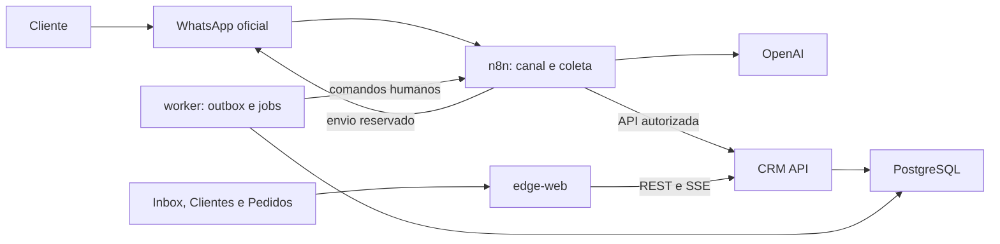

# TDD — CRM Silmer MVP

Baseline técnica atualizada em 05/10/2026 após a PR #142. Esta síntese
substitui o desenho anterior que ainda tratava Kanban, Negócio e pagamentos
como runtime do lançamento. Decisões e aprovações históricas permanecem nos
ADRs e no Git. Esta revisão não cria evidência de produção.

Tech Lead e responsável de privacidade: `silmer:romulo.sutil`, conforme
T00.6. A exceção solo é restrita ao piloto interno; não comprova infraestrutura
ou recuperação. Fontes: [RULES](RULES.md), [spec CRM](.specs/features/crm-mvp/spec.md),
[spec Pedidos](.specs/features/pedidos-mvp/spec.md) e
[topologia](EASYPANEL-TOPOLOGY.md).

## 1. Escopo e processos

O monólito modular usa JavaScript ESM, Vue 3/Vue Router/Vite no frontend,
Fastify na API e PostgreSQL para domínio e filas. Node.js `24.20.0` e npm
`11.19.0` são fixados. Outros frameworks, store global, microserviços e Redis
não fazem parte da baseline.

| Processo | Responsabilidade                                          |
| -------- | --------------------------------------------------------- |
| edge-web | SPA compilada, headers, proxy API/SSE; TLS pelo EasyPanel |
| api      | Sessão, ACL, REST, comandos, consultas e eventos          |
| worker   | Outbox CRM→n8n, jobs internos, retenção e reconciliação   |
| postgres | Dados oficiais, auditoria e jobs persistentes             |
| n8n      | WhatsApp, OpenAI, coleta guiada e handoff; banco próprio  |

O produto inclui Inbox, Clientes, Pedidos, Dashboard, Vendedores e Conta.
Pedido/Ficha já existem. Negócio/Kanban estão aposentados pela ADR 004;
Instagram é fase posterior. Cobrança PIX, envio automático da Ficha, arquivos
duráveis e cancelamento comercial seguem como fronteiras pendentes.

## 2. Caminho de runtime

```mermaid
flowchart LR
    client[Cliente] --> meta[WhatsApp oficial]
    meta --> n8n[n8n: canal e coleta]
    n8n --> ai[OpenAI]
    n8n -->|API autorizada| api[CRM API]
    api --> pg[PostgreSQL]
    ui[Inbox, Clientes e Pedidos] --> edge[edge-web]
    edge -->|REST e SSE| api
    worker[worker: outbox e jobs] --> pg
    worker -->|comandos humanos| n8n
    n8n -->|envio reservado| meta
```

Toda mensagem válida inicia o workflow; a UI não dispara o bot. O n8n nunca
acessa o banco do CRM. O CRM determina autorização, gates e versão atual.
Falhas n8n/Meta/IA ficam visíveis. Não há fallback silencioso Meta→CRM.

## 3. Fronteiras e dados

| Módulo ativo            | Responsabilidade                                                   |
| ----------------------- | ------------------------------------------------------------------ |
| identity-access         | Contas, função Vendedor, capacidades, sessões e revogação          |
| contacts                | Contato e identidades de canal; associação verificável             |
| inbox-channels          | Conversas, mensagens, handoffs e operação humana                   |
| n8n-integration         | Eventos canônicos, briefing, reserva e comandos                    |
| orders                  | Pedido pendente/confirmado, ficha, snapshot e impressão            |
| integration-reliability | Idempotência, fila, efeito incerto e reconciliação                 |
| audit-privacy           | Auditoria e retenção de mídia; demais controles com gates próprios |
| configuration/catalog   | Configuração e catálogo versionados existentes                     |

Tabelas centrais incluem usuários/sessões, contatos/identidades, conversas,
mensagens, handoffs e `crm.orders`, com ficha e snapshot em colunas JSONB.
Também existem `audit_events`, `n8n_events`, `n8n_commands`, idempotência e jobs.
A numeração do Pedido usa a sequência `crm.order_number_seq` (migração 0023).
Conferir a migration específica antes de alterar SQL.

Migrations até `0026_message_first_sent_at.expand.sql` estão versionadas.
Isso não prova aplicação no ambiente alvo. Tabelas/módulos de Negócio,
qualificação e execução antiga permanecem por compatibilidade com migrations
publicadas; não orientam novas telas. Remoção exige contract separado,
análise dos dados e compatibilidade de rollback.

O domínio usa transações, unicidade, locking e versões otimistas. JSONB é
restrito a payloads e snapshots adequados. Ledger externo de tombstones e
reaplicação no restore têm gate T06.3/issue #3; auditoria não os substitui.

## 4. API e automação

REST `/api/v1` segue o OpenAPI versionado. Os três endpoints n8n são inbound,
attachment e events. Usam Basic Auth de serviço com `AUTOMATION_EXECUTOR`,
idempotência, correlação e identificação de workflow. Credenciais n8n→CRM e
CRM→n8n são distintas, sem sessão humana nem acesso administrativo.

Briefing pertence à Conversa. O CRM confere epoch/revisão antes do efeito.
`message.send.requested` reserva um único envio antes da Meta.
`send_authorized: false` em replay não permite novo envio. Timeout após o
ponto de não retorno vira `message.send.unknown`, sem retry cego.
Status confirmados não regridem; entrega publica SSE na mesma transação.

Handoff é reivindicado por CAS, com um vencedor. Takeover invalida decisões
antigas. Conversa transferida não volta ao bot (ADR 015).
Contrato, diagnóstico e rollout: [n8n](docs/integrations/n8n/README.md) e
[ator técnico](docs/runbooks/automation-executor.md).

## 5. Pedido, impressão e métricas

Pedido tem `pendente` e `confirmado` (ADR 006). O primeiro ponto confirmado
da ficha pode abrir/reutilizar o pendente na Conversa (ADR 014).
O número é reservado na criação do Pedido. O vendedor responsável completa e
confirma; a confirmação fixa pessoa, horário e snapshot. Reabertura preserva
o número e a rastreabilidade. Nome do pendente acompanha
o Contato; o confirmado preserva seu snapshot (ADR 018).

ADR 020 / PR #142 define Técnica por item (`tipo_servico`) e Arte por pedido.
Gerar exige pontos obrigatórios dos itens, arte e entrega prometida. A edição
parcial é permitida. `summary.aplicacao`, `modelo` e campos antigos seguem
preservados para compatibilidade, sem criar novos critérios de geração.

ADR 025: cada item tem `publico` (masculino, feminino, infantil, unissex) e
`quantidade_informada` opcionais, que não bloqueiam gerar. A divisão dita ao
bot (`audiences`) vira um item por público quando o domínio a lê sem dúvida
(`modules/orders/src/domain/audiences.js`); "Tecido" passa a "Modelo de
malha". O bot pergunta pelo produto, com kits e pontos passivos (ADR 024).

`GET /api/v1/orders/:orderId/print` exige sessão de leitura autorizada e
Pedido confirmado. Retorna HTML imprimível da v6 (público de cada item e
"Modelo de malha"), escolhida em `modules/orders/src/print/index.js` e
aprovada provisoriamente pelo PO em 06/10/2026. PDF sintético e hashes são
artefatos de aprovação, sem prova de envio externo. V2 a v5 não são
sobrescritas. Assinatura física de Rose/Operação na v6 segue obrigatória
antes da produção.

Dashboard/listas usam read models autorizados. Vendido/vendas contam
confirmados e não representam recebimentos. SSE usa IDs e metadados mínimos.
Reconexão recupera estado; conflito preserva rascunho até atualização.
Teclado, foco e ARIA fazem parte do aceite.

## 6. OpenAI, acesso e privacidade

OpenAI é o provedor do MVP ([ADR 021](docs/adr/021-adotar-openai-no-mvp.md)).
O workflow usa `gpt-5.6-luna` via Responses API, parser estruturado e
validação CRM. Um segundo provedor é evolução, sem fallback automático.
Spikes Gemini são históricos; seus testes não aprovam OpenAI.

Modelo implantado, billing, chave, request real, persistência/cache, DPA,
retenção, região e ZDR precisam de evidências do projeto efetivo.
`store: false` não comprova ZDR. Produção com PII segue condicionada à
política aprovada. A fonte do nó não explicita esse parâmetro; não presumir
seu valor no request. [Checklist OpenAI](docs/integrations/openai/README.md).

Função humana: Vendedor, capacidades ortogonais e deny-by-default.
MFA saiu do CRM pela migration 0012; proteção do EasyPanel é distinta.
Cookie seguro, CSRF, revogação e ACL no servidor continuam obrigatórios.
Auditoria de negócio difere de log técnico. Logs não contêm mensagem,
prompt, resposta completa, comprovante ou segredo. Retenção/acesso/exclusão
seguem P0.6. Aprovar threat model não comprova implantação dos controles.

## 7. Mídia e documentos duráveis

Mídia de canal é privada e temporária. Bytes expiram no fim da jornada ou
em sete dias. Quarentena, limites, MIME/hash e scan precedem acesso.
Worker trata retenção; detalhes em [TRANSIENT-MEDIA](docs/phase0/TRANSIENT-MEDIA.md).

Perda da única cópia resulta em `lost/unavailable`. Arquivos válidos são
anexados ao pedido. Os arquivos da arte (5 de até 10 MB e a arte final) ficam
no RustFS interno, só pela API, com catálogo cifrado, assinatura do conteúdo,
auditoria e idempotência ([ADR 023](docs/adr/023-arquivos-da-arte-no-rustfs.md)).
O RustFS divide a VPS com o PostgreSQL; o risco é aceito com o bucket no
backup off-host e no drill. S3/R2 externo segue diferido na issue #29; isso
não dispensa backup de bancos/documentos duráveis. Pedidos/Fichas e auditoria
não herdam a retenção curta de mídia.

## 8. Deploy, recuperação e observabilidade

Manter deploy automático GitHub→EasyPanel
([ADR 022](docs/adr/022-manter-deploy-automatico-github-easypanel.md)).
Auditar origem/ref, gatilho, SHA implantado, build/imagem, saúde e rollback.
CI publica GHCR por SHA/digest com scan, SBOM e provenance; isso não comprova
consumo da imagem nem vínculo do deploy externo com CI. Se o deploy antecede
os gates, registrar e corrigir no fluxo escolhido antes do go-live.

Migrations seguem expand/contract e precedem workflows dependentes de campos
novos. Rollback recupera release anterior compatível, pausa automação e
preserva efeitos incertos. Restore de banco é último recurso, com ledger
de exclusões reaplicado antes de readiness.

Backup externo de CRM e n8n, chave de credenciais recuperável e escrow são
obrigatórios. Drills isolados demonstram RPO ≤ 60 minutos e RTO ≤ 240 minutos
do conjunto. Mocks não comprovam esses objetivos.
[Runbook recovery](ops/recovery/RUNBOOK.md), issue #3 e topologia detalham gates.

Monitor off-host, alertas API/worker/jobs/n8n/backup, roteamento e drills
permanecem issue #11. Hardening deve ser comprovado no container implantado.
Health público não substitui monitor off-host.
[Relatório atual](docs/runbooks/production-readiness-checks.md).

## 9. Verificação e rastreabilidade

Gates oficiais: `npm ci`, `npm run validate`, `npm run test:e2e` e
`npm audit --audit-level=high`. CI acrescenta PostgreSQL real serializado,
scan obrigatório e artefatos de release. Migrations, ACL, disputa/replay,
PII, timeout e efeitos incertos têm cenários negativos pertinentes.

Carga T07.1 usa envelope aprovado na issue #8, sem presumir SLOs medidos.
UAT valida atendimento, Pedido/Ficha, acessibilidade e falhas. Liberar
tráfego exige evidências de WhatsApp, privacidade, assinatura física,
backup, alertas e recuperação.

Tarefas: [CRM](.specs/features/crm-mvp/tasks.md) e
[Pedidos](.specs/features/pedidos-mvp/tasks.md). Entrega de 05/10:
OPS-DOC-01, OPS-CI-01, OPS-CHK-01 e OPS-AI-01. Relatórios distinguem checks
concluídos de lacunas externas; documentação não autoriza go-live.
